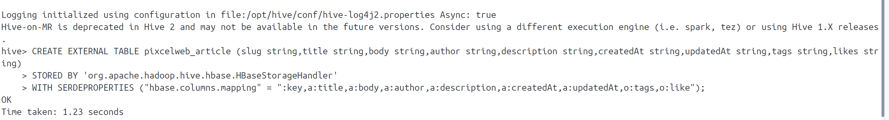

# ps: docker-compose up

## http

* <http://localhost:9870>  hadoop
* <http://localhost:16010>  hbase
* <http://localhost:8088>  hadoop

## 启动容器后

进入hbase容器，执行/opt/hbase-1.2.6/bin/hbase-daemon.sh start thrift 连接python

## hive创建外部表

hive通过建立外部表和hbase数据库产生映射关系

*CREATE EXTERNAL TABLE* pixcelweb_article (slug string,title string,body string,author string,description string,createdAt string,updatedAt string,tags string,likes str ing)
*STORED BY* 'org.apache.hadoop.hive.hbase.HBaseStorageHandler'
*WITH SERDEPROPERTIES* ("hbase.columns.mapping" = ":key,a:title,a:body,a:author,a:description,a:createdAt,a:updatedAt,o:tags,o:like");

